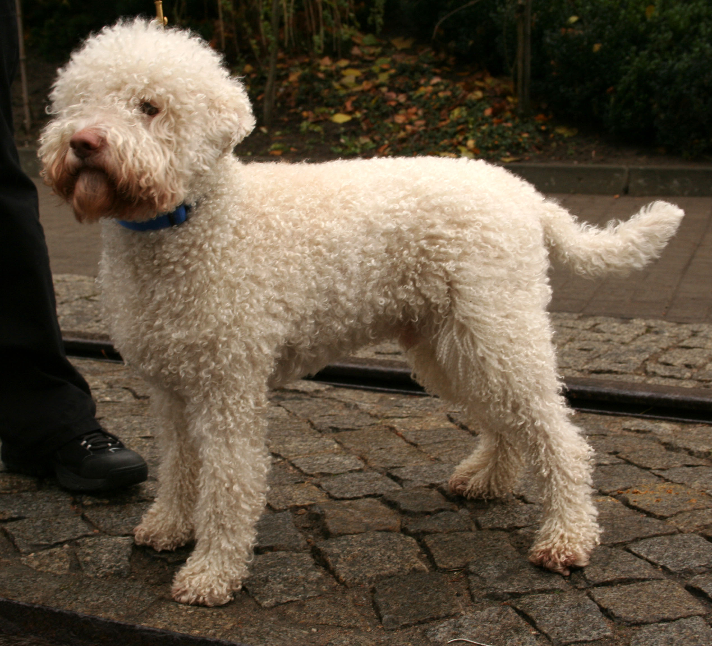

#Lagotto Romagnolo

Gruppe 8: Apportierhunde – Stöberhunde – Wasserhunde
Sektion 3: Wasserhunde
Ohne Arbeitsprüfung
Ursprung:	
Italien

Alternative Namen:	
##Wasserhund der Romagna
###Italienischer Trüffelhund[1]

**Widerristhöhe:	
Hündinnen: 41–46 cm
 (ideal 43 cm)
Rüden: 43–48 cm
 (ideal 46 cm)
Toleranz: ± 1 cm
Gewicht:	
Hündinnen: 11–14 kg
Rüden: 13–16 kg

Liste der Haushunde
Der Lagotto Romagnolo (ital. für Wasserhund der Romagna) ist eine von der FCI anerkannte italienische Hunderasse (FCI-Gruppe 8, Sektion 3, Standard Nr. 298), die in ihrem Ursprungsgebiet zur Trüffelsuche eingesetzt wird.

Inhaltsverzeichnis
1	Herkunft und Geschichtliches
2	Beschreibung
3	Wesen
4	Krankheiten
5	Einzelnachweise
6	Weblinks
Herkunft und Geschichtliches
Der Lagotto Romagnolo gehört zu den sehr alten Wasserhunderassen. Erwähnung findet der Lagotto bereits im 17. Jahrhundert. Die „Vallaroli“ (Lagunenjäger) setzten den Lagotto Romagnolo in Sumpf- und Morastgebieten ein. Seine Aufgabe war damals das Auffinden und Apportieren von geschossenem Wasserwild. Das für Wasserhunde typische, gekräuselte, leicht ölige Fell machte es möglich, unversehrt selbst im eiskalten Wasser zu arbeiten. Seit Ende des 19. Jahrhunderts nach der Urbarmachung der Feuchtgebiete wird die Rasse in der Romagna als Trüffelsucher eingesetzt und zeigt üblicherweise kaum noch Jagdverhalten.

Der Name „Lagotto“ rührt daher sicherlich von seiner ursprünglichen Funktion als Wasserhund her. Im Dialekt der Romagna bedeutet „Càn Lagòt“ „Wasserhund“ oder „Hund mit lockigem Haar für die Jagd im Sumpfgebiet“.

Beschreibung
Der Lagotto wird bis zu 48 cm groß und 16 kg schwer, er ist ein wohl proportionierter (quadratischer), kräftig gebauter Hund. Sein Fell ist wollig, oberflächlich etwas rau, mit eng gerollten ringförmigen Locken. Das Fell des Lagotto Romagnolo kann vielfältig gefärbt sein: Einfarbig schmutzig-weiß, schmutzig-weiß mit braunen oder orangefarbenen Flecken, einfarbig braun in verschiedenen Abstufungen, einfarbig orangefarben oder braun geschimmelt, braune bis dunkelbraune Masken sind zulässig. Der Lagotto haart nicht.

